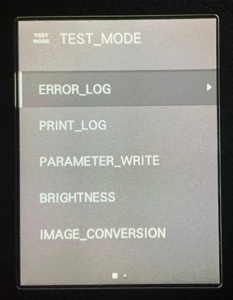
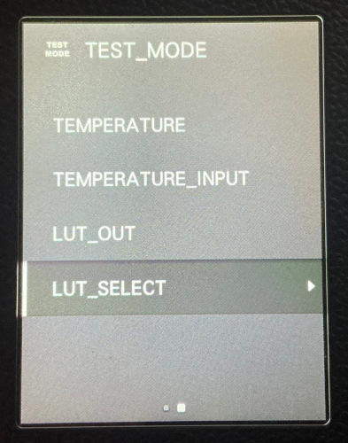

# Instax Evo Test Mode
Firmware Version: 1.0.6

This a menu that can temporarily appear after the "Firmware Upgrade" option in the Playback Menu. It seems to expose logging and debug output that would be useful during the development and repair of the camera.

## Features
* Enable saving CSV files containing what appear to be 1D LUTs
* ? Enable logging

## How To Enable Menu
This process must be followed each time you want to access the menu. The settings changed will stay, even after power off.

In order to access the menu you must have taken a photo. And it can be accessed whether the photo is on the internal card or external card.

1. From camera mode, press the play button to enter Playback Mode.
2. Select a photo with the "MENU / OK" button to display the Playback Menu.
2. Press "MENU / OK" button.
3. Select "ERASE"
4. Select "FRAME"
5. Press the "Play" button 3 times. The first two times the screen will flash and display the picture thumbnails. The third time you will be returned to the full size photo.
6. Press the "MENU / OK" button to go back. You should see "FRAME" and "ALL FRAMES" again.
7. Press the physical "Back" button.
8. Press the "Up" button which will scroll all of the way to the bottom of the list.

You should now see a new option labeled "TEST_MODE".

## Options
### ERROR_LOG

### PRINT_LOG

#### LONG
After printing from Bluetooth, the camera got stuck displaying the "PROCESSING" animation over the live view from the camera. The auto sleep never kicked in to turn the camera off. Turning the camera to "OFF" didn't actually turn the camera off. And I was forced to use the reset button under the SD card cover. The frame counter didn't even decrease!

There was a directory called PLOG created on the SD card, but there were no files in it.

When the camera turned back on the PRINT_LOG option was set to OFF.

#### SHORT
When enabled, triggered a file to get put in PLOG/PLOG0001.CSV. This file has detailed information about the photo and the print process. The first column is a key, and the second column is a value.

In the current example file there is a key for "result" which is set to "No Film PI". This is because of the counter issue noted previously. The camera didn't know how much film was left and tried to print when it was empty.

### TEMPERATURE AND TEMPERATURE_INPUT
When enabled under "TEMPERATURE" the "TEMPERATURE_INPUT" option allows you to set the "temperature". This value appears in the print log, and was originally equal to roughly the ambient temperature of the room. When setting it all of the way to 40, it didn't appear to change the picture, just the log. Perhaps this is a test for an internal sensor that checks for runaway thermal issues.

### LUT_OUT
Enabling this option triggers the camera to drop a directory at "PARA/OUTPUT" containing 12 files. All of which appear to be 1D Look-Up Table (LUT) files used for translating an 8-bit color channel to an RGB color. There are 4 sets, each with 3 files. I think it is "FT" vs "TP" (dont know) and then a "3D" and "Normal" copy. Each set then has a H, M, and L; I assume this is "High" "Medium" and "Low".

It is worth noting that the "3D" files don't appear to be actual 3D LUT files.

### LUT_SELECT
This does not seem to have an effect on what was exported as part of LUT_OUT. And has no noticeable change on the photo print quality. It also doesn't appear to change the print log mentioned above. There is a value for "3DLUT_enable" but it hasn't been affected by LUT_SELECT. It is "ON" in all of the photos I've printed.
